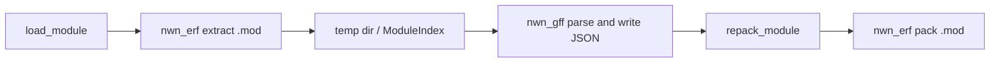
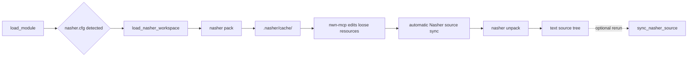

# NWN MCP Server

[](LICENSE)

An [MCP](https://modelcontextprotocol.io/) (Model Context Protocol) server for **Neverwinter Nights: Enhanced Edition** module files (`.mod`). It wraps [neverwinter.nim](https://github.com/niv/neverwinter.nim) CLI tools to let AI assistants read, query, and modify NWN modules through structured tool calls.

## Features

- **Load and inspect** `.mod` files — areas, creatures, items, dialogs, scripts, placeables, and more
- **Create and edit** areas, place objects, write dialogs, build quests
- **Compile scripts**, manage journals, link area transitions, and validate modules
- **Bulk operations** — rename tags, move or remove objects across areas, and orchestrate complex multi-step changes with natural language
- **Search blueprints** across the full resource stack (base game + HAKs + module)
- **Spatial awareness** — JSON payload of tile grids, walkable zones, and placed objects for AI reasoning
- **Query and update** NWN SQLite campaign databases
- **HTML area reports** — interactive visual maps of areas for human review

**Bonus:** A fully autonomous one-shot adventure creator. Give it a prompt, sit back, and get a playable module — areas painted, NPCs placed, quests written, loot balanced, all hands-free. Use `/create-adventure` and have fun. (Warning: spoiler-free by design — the DM gets surprised too.)

Designed for two workflows:

1. **AI-assisted module design** — You stay in creative control while an AI helps build, modify, and extend your module via natural language.
2. **AI-driven adventure creation** — A small, proof-of-concept tool that lets an LLM autonomously generate one-shot adventures for you and your friends — quests, dialogue, areas, and placed content from a high-level prompt. Spoiler-free by design, so the DM can be surprised too. *Warning: Fully AI-generated content is best-effort, especially autonomous area painting. There may be dragons!*

## Prerequisites

- [Node.js](https://nodejs.org/) v18+
- [neverwinter.nim tools](https://github.com/niv/neverwinter.nim/releases) — `nwn_erf`, `nwn_gff`, `nwn_script_comp`, `nwn_twoda`, `nwn_resman_cat`
- Neverwinter Nights: Enhanced Edition (for base game data)
- Optional: [Nasher](https://github.com/squattingmonk/nasher) and NWNT for Nasher text-source projects
- MCP-compatible AI client (Claude Code, Claude Desktop, VS Code, etc.)

## Installation

### 1. Clone and build

```bash
git clone https://github.com/Txpple/nwn-mcp.git
cd nwn-mcp
npm install
npm run build
```

### 2. Download neverwinter.nim tools

Download the latest release for your platform from [neverwinter.nim releases](https://github.com/niv/neverwinter.nim/releases) and extract the binaries to a folder you'll reference below.

### 3. Configure your MCP client

Add the server to your MCP client config. The config location depends on your client:

| Client | Config file |
|--------|-------------|
| Claude Code | `.claude/settings.json` or `.mcp.json` in your project |
| Claude Desktop | `claude_desktop_config.json` |
| VS Code | MCP settings in `.vscode/mcp.json` |
| Codex CLI | `~/.codex/config.toml` or `codex mcp add` |

```json
{
  "mcpServers": {
    "nwn-mcp": {
      "command": "node",
      "args": ["dist/index.js"],
      "cwd": "/path/to/nwn-mcp",
      "env": {
        "NIM_FOLDER_NWTOOLS": "/path/to/neverwinter-nim-tools",
        "NWN_FOLDER_DATA": "/path/to/Neverwinter Nights",
        "NWN_FOLDER_USER": "/path/to/Documents/Neverwinter Nights",
        "MCP_FOLDER_TEMP": "/path/to/temp",
        "MCP_FOLDER_USERREPORTS": "/path/to/reports",
        "NASHER_BIN": "nasher",
        "NWNT_BIN": "nwn_nwnt"
      }
    }
  }
}
```

**Codex CLI example:**

Codex stores MCP servers in `$CODEX_HOME/config.toml` (usually `~/.codex/config.toml`). The `codex mcp add` command writes the executable and args directly, so point the command at the built server with an absolute path:

```toml
[mcp_servers.nwn-mcp]
command = "node"
args = ["/path/to/nwn-mcp/dist/index.js"]

[mcp_servers.nwn-mcp.env]
NIM_FOLDER_NWTOOLS = "/path/to/neverwinter-nim-tools"
NWN_FOLDER_DATA = "/path/to/Neverwinter Nights"
NWN_FOLDER_USER = "/path/to/Documents/Neverwinter Nights"
MCP_FOLDER_TEMP = "/path/to/temp"
MCP_FOLDER_USERREPORTS = "/path/to/reports"
NASHER_BIN = "nasher"
NWNT_BIN = "nwn_nwnt"
```

Equivalent command:

```bash
codex mcp add nwn-mcp \
  --env NIM_FOLDER_NWTOOLS=/path/to/neverwinter-nim-tools \
  --env NWN_FOLDER_DATA="/path/to/Neverwinter Nights" \
  --env NWN_FOLDER_USER="/path/to/Documents/Neverwinter Nights" \
  --env MCP_FOLDER_TEMP=/path/to/temp \
  --env MCP_FOLDER_USERREPORTS=/path/to/reports \
  --env NASHER_BIN=nasher \
  --env NWNT_BIN=nwn_nwnt \
  -- node /path/to/nwn-mcp/dist/index.js
```

For a standalone `.mod` workflow, omit the `NASHER_BIN` and `NWNT_BIN` lines. For a Nasher workflow, start Codex from the Nasher project root, pass `workspaceRoot` to `load_nasher_workspace`, or pass an absolute path inside the Nasher project to `load_module`.

The `NASHER_BIN` and `NWNT_BIN` entries are only needed for Nasher text-source projects. If `nasher` and `nwn_nwnt` are already on `PATH`, the default command names are enough; set absolute executable paths when your MCP client does not inherit that `PATH`.

**Windows paths example:**
```json
{
  "NIM_FOLDER_NWTOOLS": "C:/tools/neverwinter.nim/bin",
  "NWN_FOLDER_DATA": "C:/Program Files (x86)/Steam/steamapps/common/Neverwinter Nights",
  "NWN_FOLDER_USER": "C:/Users/you/Documents/Neverwinter Nights",
  "MCP_FOLDER_TEMP": "C:/Users/you/AppData/Local/Temp/nwn-mcp",
  "MCP_FOLDER_USERREPORTS": "C:/Users/you/Documents/Neverwinter Nights/reports",
  "NASHER_BIN": "C:/tools/nasher/nasher.exe",
  "NWNT_BIN": "C:/tools/nwnt/nwn_nwnt.exe"
}
```

### Environment Variables

| Variable | Required | Default | Description |
|----------|----------|---------|-------------|
| `NIM_FOLDER_NWTOOLS` | Yes | | Path to neverwinter.nim binaries |
| `NWN_FOLDER_DATA` | Yes | | NWN game install directory (base game 2DA/TLK) |
| `NWN_FOLDER_USER` | Yes | | NWN user documents directory (HAKs, overrides, modules) |
| `MCP_FOLDER_TEMP` | No | `%TEMP%/nwn-mcp` | Temp directory for extracted modules |
| `MCP_FOLDER_USERREPORTS` | No | | Directory for exported reports |
| `NASHER_BIN` | No | `nasher` | Nasher executable for optional Nasher project workflows |
| `NWNT_BIN` | No | `nwn_nwnt` | NWNT executable for Nasher diagnostics |

## Usage

Once connected, call `load_module` with a module filename to begin:

```
load_module("mymodule.mod")
```

Then use any of the 110+ tools to inspect and modify the module. Ask your AI assistant things like:

- "Load my module and show me a summary"
- "Create a forest area with a river running through it"
- "Place a merchant NPC near the tavern door and give her a shop"
- "Write a quest where the player retrieves a stolen amulet from a goblin cave"
- "Add wolves and a bear encounter to the wilderness area"
- "Go through my custom classes and update descriptions"
- "Add some new power scripts to my custom feats"
- "Validate the module and check for broken references"

Changes are written back to standalone `.mod` files via `repack_module`.

### Nasher Projects

For a Nasher text-source repository, `load_module` can remain the entry point. When `nasher.cfg` is detected from the MCP cwd or the provided module path, `load_module` automatically routes through the Nasher workflow and returns a reminder without stopping for confirmation. An absolute path outside the detected Nasher workspace is still treated as a standalone `.mod` load.

1. Call `load_module` with the module filename or target. In a Nasher project this runs `load_nasher_workspace` under the hood.
2. Optionally call `detect_nasher_project` to verify `nasher.cfg`, Nasher/NWNT availability, targets, and cache paths.
3. Optionally call `load_nasher_workspace` directly with `workspaceRoot`, `target`, and `clean` when you need explicit target or clean-build control. This runs `nasher pack`, then loads `.nasher/cache/<target>` as loose module resources.
4. Use the normal read/write tools. Edits are made in the Nasher cache directory; supported write tools automatically run `nasher unpack --file:<cacheDir>` to copy cache edits back into the text source tree.
5. Optionally call `sync_nasher_source` to rerun the unpack step explicitly, or with `removeDeleted: true` after manual cache cleanup.
6. Review source changes with `git diff`.

Auto-sync coverage currently includes area create/delete/paint/property updates, area/module script setters, `adventure_apply_layout`, and GIT object writes that go through `writeBackGit()`. If a write response does not include `nasherSync` (for example arbitrary GFF/resource edits, blueprint creation, or dialog writes), call `sync_nasher_source` before reviewing the Nasher source tree.

`clean: true` runs `nasher pack --clean` and rebuilds the cache. Supported MCP writes auto-sync to source, but manual cache-only edits can still be discarded. Use `nasher_status` to inspect the loaded Nasher context and likely stale-cache signals. `repack_module` still works, but when a Nasher workspace is loaded it only writes the packed module file; Nasher text sources remain the source of truth.

### Workflow Comparison

| Step | Standalone `.mod` | Nasher text-source repo |
|------|-------------------|-------------------------|
| Load | `load_module` | `load_module` auto-routes to `load_nasher_workspace` |
| Source of truth | Packed `.mod` file | Nasher text sources |
| Build boundary | `nwn_erf` extracts into temp dir | `nasher pack` fills `.nasher/cache/<target>` |
| Edit surface | Extracted loose module files | Loose files in Nasher cache |
| Save back | `repack_module` writes `.mod` | Supported write tools auto-run `nasher unpack`; `sync_nasher_source` can rerun it |

Standalone `.mod` workflow:



Nasher workflow:



### Special Commands

- **`export_area_report`** / **`export_module_report`** — Generate interactive HTML maps of individual areas or the entire module for visual review in a browser.
- **`/create-adventure`** — Generate a complete one-shot adventure module from a creative prompt. Uses subagents to build areas, place NPCs, write quests, and populate the world autonomously.

#### Example `/create-adventure` prompts

```
/create-adventure I'd like to play an adventure in the wilderness where I fight off
animals and survive the elements. Give a somber tone. I'll be playing solo with a single level 2 character.
```

```
/create-adventure I'd like to play an adventure with city streets and thieves' guild
intrigue — sneaking, double-crosses, maybe a heist. Make it fun and cheeky. We'll be playing with a party of
3 level 5 characters.
```

```
/create-adventure I'd like to play an adventure where I'm an agent of a wizard society
sent to investigate the society's latest crisis. Classic tabletop style. Solo player,
level 4, lots of investigation and a climactic magical battle.
```

```
/create-adventure I'd like a classic dungeon crawl — an old crypt full of undead with
a powerful lich at the end. Make it old school classic gold box style. Party of 4 players around level 6.
```

```
/create-adventure Surprise me — you pick the setting, tone, and story. Solo player, level 3.
```

Just describe the kind of adventure you want to play and your party size and level — the skill takes it from there.

## Available Tools

### Areas

- `create_area` — create a new area with terrain tiles
- `get_area_details` — area properties, lighting, weather, music
- `set_area_properties` — modify lighting, fog, music, weather
- `paint_terrain` — paint terrain by name and re-solve toolset-style edge tiles
- `paint_tiles` — set exact tile IDs on specific positions (direct placement)
- `paint_group` — place multi-tile groups (temples, lodges, etc.)
- `adventure_apply_layout` — apply a full layout atomically: zones + crossers + features via zone solver (adventure tool)
- `get_tileset_details` — tileset info with summary mode (~2KB) or full tile catalog (~60-100KB)

> **Note:** Terrain painting is best-effort — always open the module in the toolset to review painted areas and touch up as needed.
- `visualize_area` — spatial JSON payload for AI reasoning
- `export_area_report` / `export_module_report` — HTML visualizations for human review

### Object Placement

- `place_creature` / `place_placeable` / `place_door` / `place_waypoint` — place objects in areas
- `place_encounter` / `place_trigger` / `place_sound` / `place_store` — encounters, triggers, sounds, stores
- `move_object` / `remove_object` / `bulk_remove_objects` — reposition or remove objects

### Blueprints

- `list_blueprints` — search base game + HAK + module blueprints
- `create_creature_blueprint` / `create_item_blueprint` — create new blueprints
- `create_encounter_blueprint` / `create_store_blueprint` / `create_trap_blueprint` — encounters, stores, traps

### Dialogs & Quests

- `create_dialog` / `flatten_dialog` / `add_dialog_node` — write and inspect conversations
- `add_journal_quest` / `add_journal_entry` — build quest journals
- `verify_quest_completability` — trace quests from dialog to journal end entry

### Scripts

- `write_script` / `compile_script` / `read_script_source` — NWScript authoring
- `search_scripts` / `list_script_references` — find and trace script usage

### Analysis

- `validate_module` — check for broken references across the module
- `check_area_connectivity` — verify all areas are reachable via transitions
- `get_balance_report` — creature difficulty and item values per area
- `suggest_encounter` — advisory tool for encounter composition by party level

### Module Management

- `load_module` / `repack_module` — load modules and pack standalone `.mod` output
- `detect_nasher_project` / `load_nasher_workspace` / `sync_nasher_source` / `nasher_status` — optional Nasher text-source workflow
- `get_module_info` / `get_module_summary` — module metadata and overview
- `undo_last_change` / `undo_history` — revert recent changes

### Adventure Creator

Tools specific to the `/create-adventure` pipeline for autonomous module building:

- `adventure_generate_layout` — procedural area layout generation with feature suggestions (dungeon, cave, dwelling, forest, rural, city, plains, desert, castle, tundra)
- `adventure_apply_layout` — atomically apply a generated layout (zones + crossers + features) via the zone solver
- `adventure_list_features` — enumerate solver-compatible feature groups for a tileset and style
- `adventure_find_walkable` — find guaranteed walkable coordinates in an area region
- `adventure_create_transition` — bidirectional portal transitions (single call places lights + waypoints in both areas)

## Architecture

```
.mod file --> nwn_erf (extract) --> temp dir --> nwn_gff (parse GFF to JSON)
  --> in-memory ModuleIndex (tags, scripts, areas, dialogs, creatures, items)
    --> MCP tool handlers serve queries & modifications
      --> nwn_gff (serialize back) --> nwn_erf (repack) --> .mod file
```

Nasher workflow uses `.nasher/cache/<target>` as the integration boundary: Nasher converts source text to loose resources, `nwn-mcp` edits those loose resources, then supported write tools automatically ask Nasher to unpack the cache back to source text.

One module is loaded at a time. The server builds a full resource manager stack on load — base game BIFs, module HAKs, user overrides, and module resources — giving tools access to the complete data hierarchy.

All tools carry [MCP annotations](https://spec.modelcontextprotocol.io/specification/2025-03-26/server/tools/#annotations) (`readOnlyHint`, `destructiveHint`, `idempotentHint`) so clients can understand tool behavior. Adventure-creator-specific tools are separated into `src/tools/adventure-tools.ts`; all other tools are base tools for general module editing.

## Scope

Targets **non-persistent world modules** — single-player and small co-op campaigns. Focused on instanced objects placed in areas (GIT contents). Blueprint modification, palette-level changes, and deep 2DA/ruleset authoring are out of scope. That being said, these are all possible with careful prompts.

## Development

```bash
npm run dev          # Run with tsx (hot reload)
npm run build        # Compile TypeScript
npm run start        # Run compiled output
npm run test         # Run tests (vitest)
npm run lint         # Lint with Biome
npm run format       # Format with Biome
```

## Troubleshooting

- **neverwinter.nim tools not found** — Verify `NIM_FOLDER_NWTOOLS` points to the directory containing the binaries, not a parent folder.

## Support

- **Issues**: [GitHub Issues](https://github.com/Txpple/nwn-mcp/issues)

## Acknowledgments

- [Niv](https://github.com/niv) at [neverwinter.nim](https://github.com/niv/neverwinter.nim) for all the awesome stuff he's provided
- The NWN Discord and Zulip communities

## License

MIT License — see [LICENSE](LICENSE) for details.
